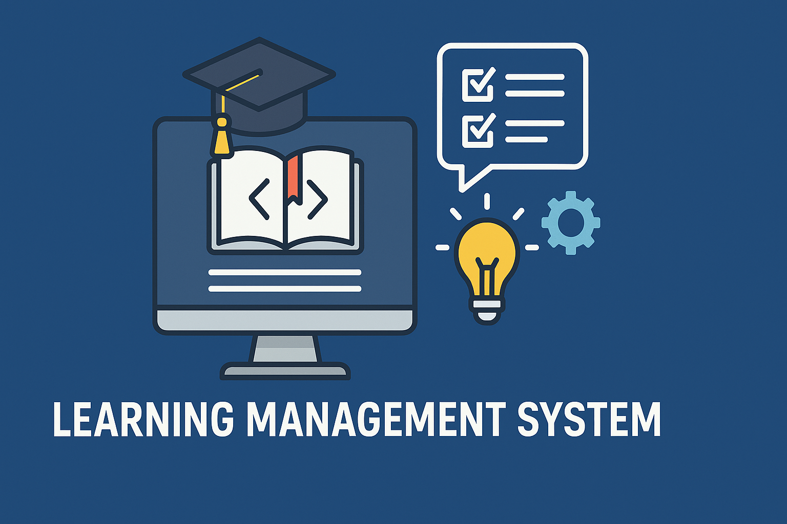

<p align="center"></p>

## 🧠 BrainAcad Project (Web version)


📘 **BrainAcad Project (MainAcad Project)** is a console-based **Learning Management System (LMS)** application, developed as part of the **Junior Java Developer** course at Brain Academy ([Main Academy 1](https://mainacademy.ua) or [Main Academy 2](https://lms.mainacad.com/)) (2015–2016). The project demonstrates key principles of object-oriented programming, working with collections, data serialization, and Java application architecture.

## 🎓 Implemented Features

- 📚 **Course Management** — create, edit, and delete courses.
- 👨‍🎓 **Student Management** — register students and view student information.
- 🧑‍🏫 **Teacher Management** — create teacher profiles and assign them to courses.
- 📝 **Course Enrollment** — students can enroll in available courses.
- 📄 **Reporting** — display information about courses, students, and teachers.
- 💾 **Data Persistence** — uses H2 in-memory database with JPA for data storage and retrieval.

## 🛠️ Technologies

- Java SE 8+
- Maven

## 📚 Project Purpose

This project was created for educational purposes to demonstrate practical skills in Java programming. It can serve as a foundation for more complex applications or as a starting point for learning:

- Object-Oriented Design
- Java Collections Framework
- Data serialization and application state management

## 🚀 How to Run

If you don't use an IDE, you can still compile and run the project using **Maven** and **Java** from the command line.

---

### ✅ Prerequisites

Make sure the following are installed:

- [Java JDK 8 or later](https://www.oracle.com/java/technologies/downloads/)
- [Apache Maven](https://maven.apache.org/)

You can check them with:

```bash
java -version
mvn -v
```

---

### 📦 Step-by-Step Instructions

#### 1. Clone the repository

```bash
git clone https://github.com/VIBondarenko/brainacadproject.git
cd brainacadproject
```

#### 2. Compile the project

```bash
mvn clean compile
```

This will compile all source files and place compiled `.class` files into the `target/classes` folder.

#### 3. Run the application

Make sure your `pom.xml` contains this section:

```xml
<build>
  <plugins>
    <plugin>
      <groupId>org.codehaus.mojo</groupId>
      <artifactId>exec-maven-plugin</artifactId>
      <version>3.1.0</version>
      <configuration>
        <mainClass>com.brainacad.ecs.EducationControlSystem</mainClass>
      </configuration>
    </plugin>
  </plugins>
</build>
```

Then run the app using:

```bash
mvn exec:java
```

---

### 💡 Alternative (manual Java compile/run without Maven)

If you want to run the project purely via `javac` and `java`:

#### 1. Compile

```bash
javac -d out src/main/java/com/brainacad/ecs/*.java src/main/java/com/brainacad/ecs/enums/*.java
```

#### 2. Run

```bash
java -cp out com.brainacad.ecs.EducationControlSystem
```

---

## 🧩 Notes

- The entry point is the `EducationControlSystem` class.
- Data is persisted automatically in H2 database.
- All interactions are via a console-based menu system.

## 📬 Feedback

Author: [Vitaliy Bondarenko](https://github.com/VIBondarenko)  
Feel free to open issues for discussions, suggestions, or questions!
