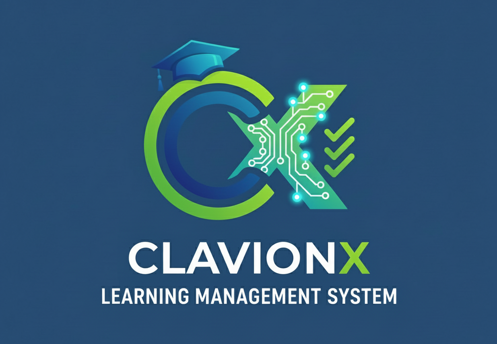

<p align="center">
  
</p>

## 🧠 ClavionX (Web version, renamed BrainAcad Project)

> ⚠️ The project is under active development. Many features are not yet implemented or are still in progress ⚠️


[](./LICENSE)


**ClavionX** was originally developed as a console-based Learning Management System (LMS) for the Junior Java Developer course at Brain Academy (MainAcademy). The application is now being rewritten as a modern web application using Spring Boot and related technologies. The project demonstrates layered architecture, database work via JPA, Thymeleaf templates, and Spring Security.

---

## 🎓 Main (and Planned) Features

- 📚 Course management (create, edit, view)
- 👨‍🎓 Student management (registration, view)
- 🧑‍🏫 Teacher management
- 📝 Course enrollment
- 📄 Reporting for courses and users
- 🔐 Authentication and password recovery
- 💾 Persistence via JPA/Hibernate
- 🧪 Unit and integration tests (JUnit 5, Testcontainers)
- 📑 API documentation via OpenAPI/Swagger

---

## 🛠️ Technologies

- Java 21
- Spring Boot 3.x, Spring Data JPA, Spring Security
- PostgreSQL (or MySQL/MariaDB)
- Thymeleaf (templates)
- MapStruct (DTO mapping)
- SLF4J (logging)
- Testcontainers, JUnit 5, Mockito
- Docker, docker-compose (local development)

---

## 🚀 Quick Start

### 1. Clone the repository

```bash
git clone https://github.com/VIBondarenko/brainacadproject.git
cd brainacadproject
```

### 2. Configure environment variables

- Copy `.env.example` to `.env` and set your values (DB, passwords, etc.)
- Main application settings are in `src/main/resources/application.yml` and profiles `application-dev.yml`, `application-prod.yml`

### 3. Set up the database

- Create the database and user (see instructions in README or Liquibase changelog)
- Migrations are applied automatically on startup

### 4. Build and run the application

```bash
mvn clean spring-boot:run
```

- For dev profile: `mvn clean spring-boot:run -Dspring.profiles.active=dev`
- For prod: `mvn clean spring-boot:run -Dspring.profiles.active=prod`

### 5. API Documentation

- Swagger UI: [http://localhost:8080/swagger-ui.html](http://localhost:8080/swagger-ui.html) (if enabled)

### 6. Tests

```bash
mvn test
```

---

## ⚠️ Important

- Do not store secrets in the repository! Use `.env` and environment variables.
- For production, use a separate profile and security settings.

---

## 📬 Feedback

Author: [Vitaliy Bondarenko](https://github.com/VIBondarenko)

Feel free to open issues for discussions, suggestions, or questions!
